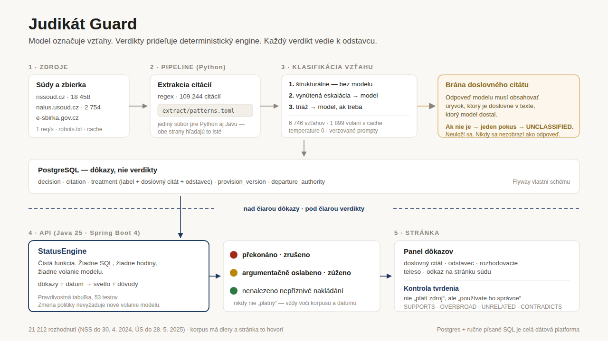

# Judikát Guard

An automated validity checker for Czech legal sources. Paste a brief, a judgment or an
opinion, and it reports every court decision and statutory provision the document relies on —
each with a traffic light and the verbatim evidence behind it.

**Live:** https://judikat-guard-ilaeix.polandcentral.cloudapp.azure.com

Czech law has no doctrine of binding precedent, so "is this judgment still good law" is not a
lookup. The answer is spread across the case law that cites it, and reading that is hours of
work. This does it in seconds, and shows its working.

Three-day hackathon proof of concept. The design document is [PLAN.md](PLAN.md).

## What it actually answers

| Question | Where it comes from |
|---|---|
| Has this decision been **overturned or weakened**? | Every later decision that cites it, classified and quoted |
| Does it rest on a **provision that has since changed**? | Statutory version history, independent of citations |
| Are you **using it correctly**? | The claim you cite it for, compared against what it held |

The second one is the interesting case: a decision can have a spotless citation history —
nothing ever said against it — and still be weakened, because the provision it interpreted was
reworded. No citation-based system finds that, because there is nothing to find.

The third asks a different question from the other two, and the page answers them separately.

## Quick start

```bash
make up          # Postgres in Docker
make migrate     # Flyway (also runs automatically on API startup)
make api         # :8080
make web         # :5173, proxies /api
```

Then open http://localhost:5173 and drop a file from [`demo/`](demo/README.md) onto the page.
`make help` lists every target.

An empty database is a working but boring demo — every citation lands in *Nepřiřazené odkazy*.
To build a corpus: `make crawl-window SINCE=… UNTIL=…`, then `make extract`, then
`make classify` (needs `GEMINI_API_KEY`).

## Layout

| | |
|---|---|
| [`api/`](api) | Java 25, Spring Boot 4 — schema, HTTP API, rules engine, query-time model calls |
| [`pipeline/`](pipeline) | Python 3.12 — crawling, normalisation, citation extraction, batch classification |
| [`web/`](web) | Vite + React — one page: upload, traffic lights, evidence panel |
| [`prompts/`](prompts) | Versioned prompt templates, read by both runtimes |
| [`extract/`](extract) | `patterns.toml` — one regex set, shared by Python and Java |
| [`infra/azure/`](infra/azure/README.md) | Terraform + cloud-init for the deployment |
| [`demo/`](demo/README.md) | Fixtures with verified outcomes, and a video script |

## The design in one paragraph

The language model does exactly one job: label the relationship between two decisions, and
quote a verbatim span from the text it was shown to justify it. A reply whose span is not a
literal substring is retried once and then discarded — never stored, never displayed as an
answer. Verdicts are assigned separately by `StatusEngine`, a pure function that reads no
database, no clock and no model. That separation is why every traffic light traces to a
paragraph of a real document, and why the verdict policy can change without re-running a
single inference.



## What it does not claim

- **It never says a source is valid.** It says no adverse treatment was found *in this corpus,
  as of this date*. The corpus is 21,212 decisions (NSS through 2024-04-30, ÚS through
  2025-05-28) and has holes, because not every decision is published. The UI says so on every
  screen.
- **Unresolved citations are reported, not hidden.** A reference it cannot place gets its own
  panel rather than a green light.
- **There is no accuracy figure.** The hand-labelled evaluation (M8) was never run, so no
  precision or recall number exists for this system. Any that appears would be invented.
- **One-hop propagation only.** Deeper weakening chains exist and are not modelled.

## Tests

```bash
make test        # 225 Java + 497 Python
```

The rules engine carries a parameterised truth table over every row of the evaluation table in
PLAN.md section 9. It is the most tested class in the repository, on purpose: it is the one
that decides what the user is told.
